# Сравнение supervised- и unsupervised-подходов к классификации небесных объектов
## Отчёт по технической части. Датасет SDSS17

Отчёт собран автоматически скриптом `scripts/09_build_report.py` из сохранённых таблиц.
Ни одно число здесь не вписано вручную.

| | |
|---|---|
| Дата прогона | 2026-08-26 |
| Дата сборки отчёта | 2026-08-26 |
| Объектов после очистки | 99999 |
| Разбиение train/test | 79999 / 20000 |
| `random_state` | 42 |
| Python | 3.12.13 |
| pandas / numpy / scikit-learn | 3.0.5 / 2.5.2 / 1.9.0 |

---

## 1. Краткие итоги

| Подход | Ключевая метрика | Значение |
|---|---|---|
| A — Random Forest | accuracy | 0.9796 |
| A — Random Forest | f1_macro | 0.9761 |
| A — Random Forest | время обучения | 9.21 с |
| B — K-Means (k = 3) | ARI | 0.2580 |
| B — K-Means (k = 3) | NMI | 0.3094 |
| B — K-Means (k = 3) | purity | 0.7340 |
| B — K-Means (k = 3) | silhouette | 0.4426 |
| B — K-Means (k = 3) | время обучения | 0.45 с |

Обучение с учителем решает задачу практически полностью; кластеризация на тех же
признаках воспроизводит истинное деление лишь частично и вообще не выделяет звёзды
в отдельную группу.

---

## 2. Данные

Источник — «Stellar Classification Dataset – SDSS17» (Kaggle), каталог Sloan Digital Sky
Survey, релиз DR17. Рабочие признаки: `u`, `g`, `r`, `i`, `z`, `redshift`.
Координаты (`alpha`, `delta`), технические идентификаторы, параметры сеанса съёмки
и спектрографа в обучении не используются — обоснование в разделе 7.

### 2.1. Очистка

| Показатель | Значение |
|---|---|
| Строк в исходном файле | 100000 |
| Пропусков в рабочих столбцах | 0 |
| Строк с неуникальным obj_ID (не удалялись) | 19154 |
| Удалено дубликатов по spec_obj_ID | 0 |
| Удалено строк с недопустимой фотометрией | 1 |
| Удалено строк с недопустимым redshift | 0 |
| Осталось после очистки | 99999 |
| Размер train-выборки | 79999 |
| Размер test-выборки | 20000 |

Два замечания, важных для воспроизведения:

* Идентификаторы `obj_ID` и `spec_obj_ID` имеют порядок 1.2·10^18, что больше 2^53,
  а в CSV часть значений записана в научной нотации. При автоопределении типа pandas
  берёт `float64` и необратимо теряет младшие разряды — разные объекты склеиваются
  в один идентификатор. Оба столбца читаются только как строки.
* `obj_ID` в этом датасете не является ключом: он повторяется у
  19154 строк, при том что фотометрия, класс и красное смещение
  у них различаются. Уникален `spec_obj_ID` — единица наблюдения здесь спектр,
  именно по нему определён класс. Дедупликация выполняется по нему.

### 2.2. Баланс классов

| class | count | share |
|---|---|---|
| GALAXY | 59445 | 59.45 % |
| QSO | 18961 | 18.96 % |
| STAR | 21593 | 21.59 % |

Выборка несбалансирована: галактик почти втрое больше, чем квазаров. Поэтому основной
метрикой Подхода A взята macro-F1, а не accuracy.

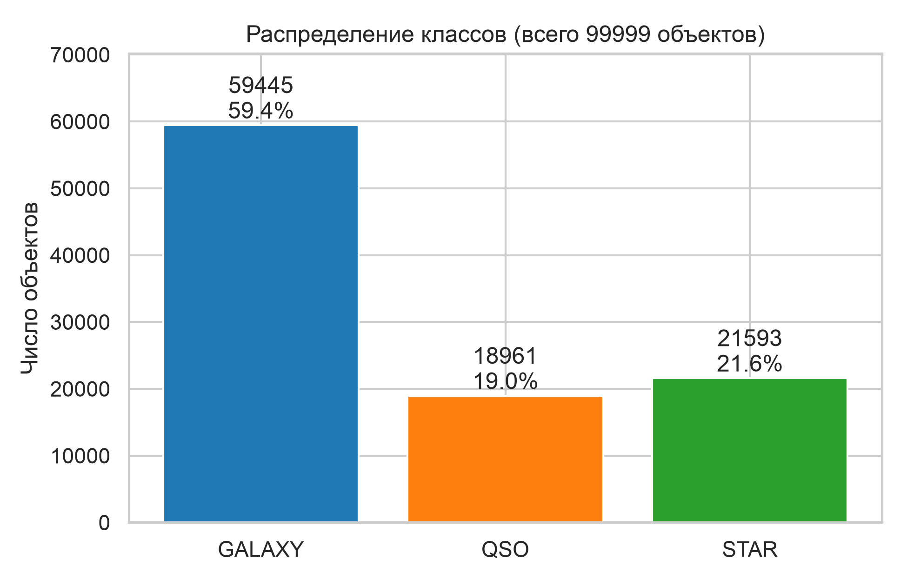

### 2.3. Описательная статистика признаков

| class | feature | count | mean | std | min | q25 | median | q75 | max |
|---|---|---|---|---|---|---|---|---|---|
| GALAXY | u | 59445 | 22.587379 | 2.264355 | 13.89799 | 20.79476 | 22.84177 | 24.20741 | 29.32565 |
| GALAXY | g | 59445 | 20.906101 | 2.107755 | 12.67902 | 18.91268 | 21.5822 | 22.44513 | 31.60224 |
| GALAXY | r | 59445 | 19.587552 | 1.874133 | 11.74664 | 17.81715 | 20.10459 | 20.97461 | 29.57186 |
| GALAXY | i | 59445 | 18.85199 | 1.689809 | 11.29956 | 17.37967 | 19.22366 | 19.94709 | 30.16359 |
| GALAXY | z | 59445 | 18.449156 | 1.656302 | 10.89738 | 17.09567 | 18.76663 | 19.47226 | 29.38374 |
| GALAXY | redshift | 59445 | 0.421596 | 0.264858 | -0.009971 | 0.164527 | 0.456274 | 0.594699 | 1.995524 |
| QSO | u | 18961 | 21.547619 | 1.495879 | 10.99623 | 20.63764 | 21.50324 | 22.28647 | 32.78139 |
| QSO | g | 18961 | 20.926193 | 1.163239 | 13.66217 | 20.24973 | 21.05629 | 21.68777 | 27.89482 |
| QSO | r | 18961 | 20.624089 | 1.084237 | 12.35763 | 20.00633 | 20.77272 | 21.41345 | 27.39709 |
| QSO | i | 18961 | 20.431173 | 1.080135 | 12.63744 | 19.81107 | 20.58211 | 21.20228 | 32.14147 |
| QSO | z | 18961 | 20.266732 | 1.095076 | 11.30247 | 19.64425 | 20.37397 | 21.00123 | 28.79055 |
| QSO | redshift | 18961 | 1.719676 | 0.913954 | 0.000461 | 1.106605 | 1.617232 | 2.220279 | 7.011245 |
| STAR | u | 21593 | 21.15383 | 2.360482 | 12.10168 | 19.32774 | 21.01065 | 22.96063 | 30.66039 |
| STAR | g | 21593 | 19.617142 | 2.119478 | 10.4982 | 18.03487 | 19.54283 | 21.22877 | 30.607 |
| STAR | r | 21593 | 18.947005 | 1.972825 | 9.82207 | 17.45395 | 18.95513 | 20.55757 | 29.37411 |
| STAR | i | 21593 | 18.54376 | 1.841753 | 9.469903 | 17.1396 | 18.59239 | 20.04198 | 30.25009 |
| STAR | z | 21593 | 18.334295 | 1.843201 | 9.612333 | 16.96417 | 18.31923 | 19.72963 | 26.42779 |
| STAR | redshift | 21593 | -0.000115 | 0.000465 | -0.004136 | -0.000295 | -7.6e-05 | 7.5e-05 | 0.004153 |
| ALL | u | 99999 | 22.080679 | 2.251068 | 10.99623 | 20.35241 | 22.17914 | 23.68748 | 32.78139 |
| ALL | g | 99999 | 20.631583 | 2.037384 | 10.4982 | 18.96524 | 21.09993 | 22.123775 | 31.60224 |
| ALL | r | 99999 | 19.645777 | 1.854763 | 9.82207 | 18.135795 | 20.12531 | 21.04479 | 29.57186 |
| ALL | i | 99999 | 19.084865 | 1.7579 | 9.469903 | 17.73228 | 19.40515 | 20.39651 | 32.14147 |
| ALL | z | 99999 | 18.768988 | 1.765982 | 9.612333 | 17.46083 | 19.0046 | 19.92112 | 29.38374 |
| ALL | redshift | 99999 | 0.576667 | 0.730709 | -0.009971 | 0.054522 | 0.424176 | 0.704172 | 7.011245 |

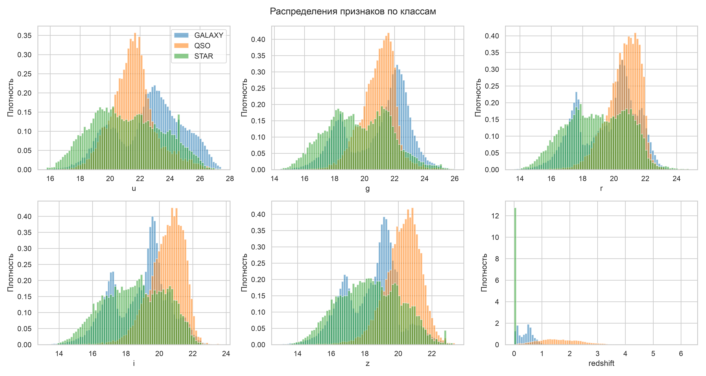

### 2.4. Корреляции признаков

| index | feature | u | g | r | i | z | redshift |
|---|---|---|---|---|---|---|---|
| 0 | u | 1.0 | 0.85335 | 0.728681 | 0.618346 | 0.54576 | 0.166816 |
| 1 | g | 0.85335 | 1.0 | 0.932996 | 0.847046 | 0.775302 | 0.31891 |
| 2 | r | 0.728681 | 0.932996 | 1.0 | 0.962868 | 0.919114 | 0.433237 |
| 3 | i | 0.618346 | 0.847046 | 0.962868 | 1.0 | 0.971546 | 0.492381 |
| 4 | z | 0.54576 | 0.775302 | 0.919114 | 0.971546 | 1.0 | 0.50106 |
| 5 | redshift | 0.166816 | 0.31891 | 0.433237 | 0.492381 | 0.50106 | 1.0 |

Звёздные величины в соседних фильтрах сильно скоррелированы между собой — это ожидаемо,
поскольку все они измеряют яркость одного объекта. `redshift` с ними связан слабо,
что и делает его самостоятельным источником информации.

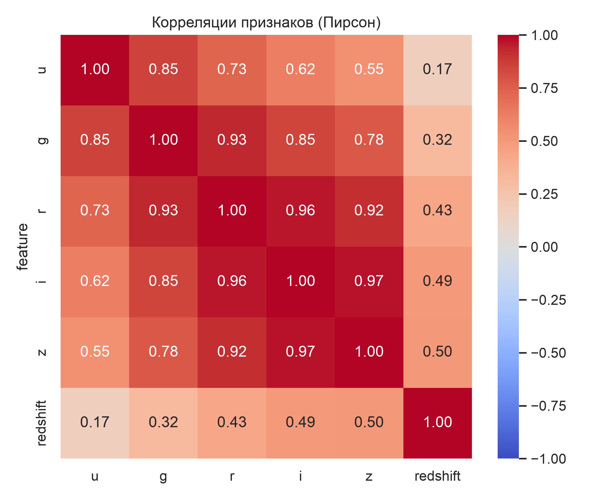

### 2.5. Цветовые индексы

| class | color_index | mean | std | median |
|---|---|---|---|---|
| GALAXY | u_g | 1.681278 | 1.232879 | 1.64035 |
| GALAXY | g_r | 1.31855 | 0.625984 | 1.40446 |
| GALAXY | r_i | 0.735562 | 0.396865 | 0.72018 |
| GALAXY | i_z | 0.402833 | 0.346448 | 0.39079 |
| QSO | u_g | 0.621426 | 0.835032 | 0.39343 |
| QSO | g_r | 0.302104 | 0.446166 | 0.21362 |
| QSO | r_i | 0.192916 | 0.385567 | 0.15221 |
| QSO | i_z | 0.164441 | 0.395095 | 0.15733 |
| STAR | u_g | 1.536688 | 0.941647 | 1.3194 |
| STAR | g_r | 0.670137 | 0.656618 | 0.52696 |
| STAR | r_i | 0.403245 | 0.610692 | 0.21087 |
| STAR | i_z | 0.209465 | 0.546539 | 0.11552 |
| ALL | u_g | 1.449096 | 1.179332 | 1.32171 |
| ALL | g_r | 0.985806 | 0.734675 | 0.93146 |
| ALL | r_i | 0.560912 | 0.501518 | 0.4798 |
| ALL | i_z | 0.315877 | 0.420396 | 0.33803 |

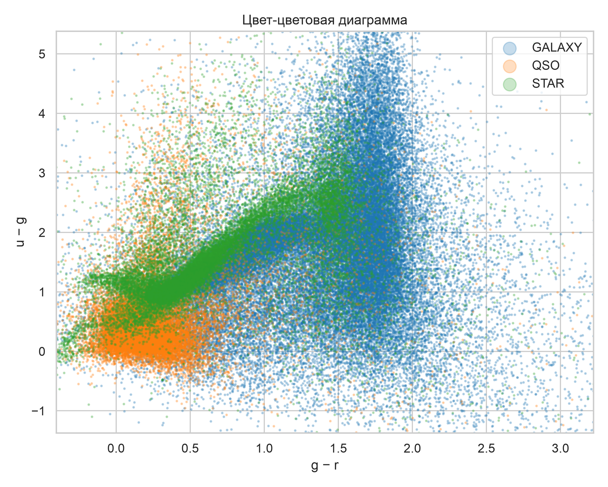

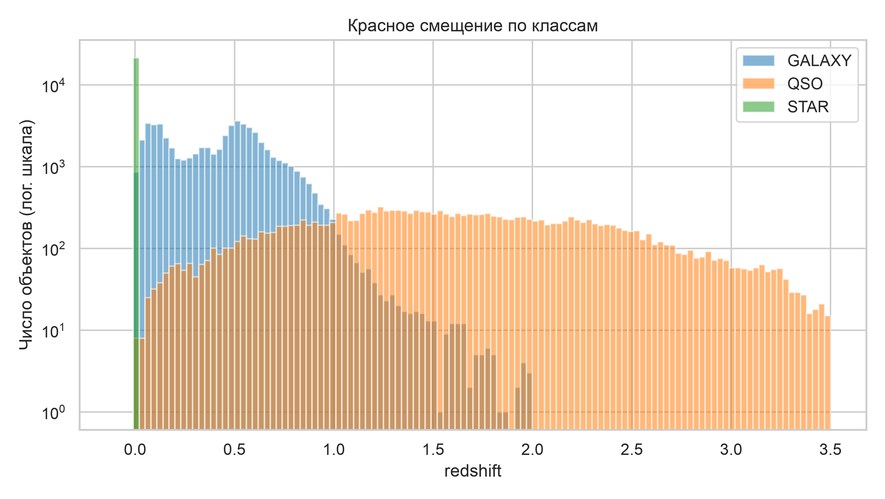

## 3. Методика

1. Очистка и отбор признаков (см. раздел 2).
2. Стратифицированное разбиение train/test в отношении
   80% / 20% с `random_state = 42`.
3. `StandardScaler` обучается **только на train-выборке** и затем применяется ко всему
   набору. Это исключает утечку в оценку Подхода A; Подход B использует тот же scaler.
4. Подход A обучается на train с истинными метками, оценивается на отложенной test-выборке.
5. Подход B обучается на полном наборе без меток; метки привлекаются только на этапе
   оценки, для majority-vote сопоставления кластеров с классами.

`silhouette_score` считается на детерминированной подвыборке в
10000 объектов: на полном наборе потребовалась бы
матрица попарных расстояний 99999 × 99999.

Воспроизводимость: `random_state` зафиксирован для разбиения, Random Forest, K-Means,
PCA и подвыборки silhouette. Два полных прогона подряд дают побайтово идентичные
таблицы; различаются только замеры времени обучения.

---

## 4. Подход A — классификация с учителем

Алгоритм: `RandomForestClassifier`. Гиперпараметры подобраны `GridSearchCV`
по 5 фолдам, критерий отбора — `f1_macro`.

Победившая конфигурация: `n_estimators = 300`,
`max_depth = 20`, средний `f1_macro` на кросс-валидации
0.9747. Перебор занял 213.9 с,
обучение финальной модели — 9.21 с.

### 4.1. Полный перебор гиперпараметров

| param_n_estimators | param_max_depth | mean_test_score | std_test_score | rank_test_score | mean_fit_time |
|---|---|---|---|---|---|
| 300 | 20.0 | 0.9746529388245256 | 0.0006718008403224 | 1 | 48.471690797805785 |
| 100 | 20.0 | 0.9745407834748744 | 0.0007971784936632 | 2 | 23.99646453857422 |
| 200 |  | 0.9744684406232312 | 0.0011114046456653 | 3 | 51.093590307235715 |
| 200 | 20.0 | 0.9744575558201012 | 0.0008421442507873 | 4 | 46.974051761627194 |
| 300 |  | 0.9743979522780906 | 0.0007867206332266 | 5 | 69.35376710891724 |
| 100 |  | 0.9741749655660088 | 0.0009624867860687 | 6 | 27.37575044631958 |
| 300 | 10.0 | 0.9731786504649488 | 0.0009093345680838 | 7 | 52.776479721069336 |
| 200 | 10.0 | 0.9731484553338317 | 0.0008938876919761 | 8 | 34.83854651451111 |
| 100 | 10.0 | 0.9728884609180944 | 0.0010468453138975 | 9 | 18.63871474266052 |

### 4.2. Метрики по классам

| class | precision | recall | f1 | support |
|---|---|---|---|---|
| GALAXY | 0.977299 | 0.988561 | 0.982898 | 11889 |
| QSO | 0.967308 | 0.928534 | 0.947524 | 3792 |
| STAR | 0.996078 | 0.999537 | 0.997804 | 4319 |
| macro avg | 0.980228 | 0.972211 | 0.976075 | 20000 |
| weighted avg | 0.97946 | 0.97955 | 0.97941 | 20000 |

Хуже всего распознаются квазары (recall
0.9285) —
их путают с галактиками. Звёзды отделяются практически безошибочно.

### 4.3. Матрица ошибок

Строки — истинный класс, столбцы — предсказанный.

| true_class | GALAXY | QSO | STAR |
|---|---|---|---|
| GALAXY | 11753 | 119 | 17 |
| QSO | 271 | 3521 | 0 |
| STAR | 2 | 0 | 4317 |

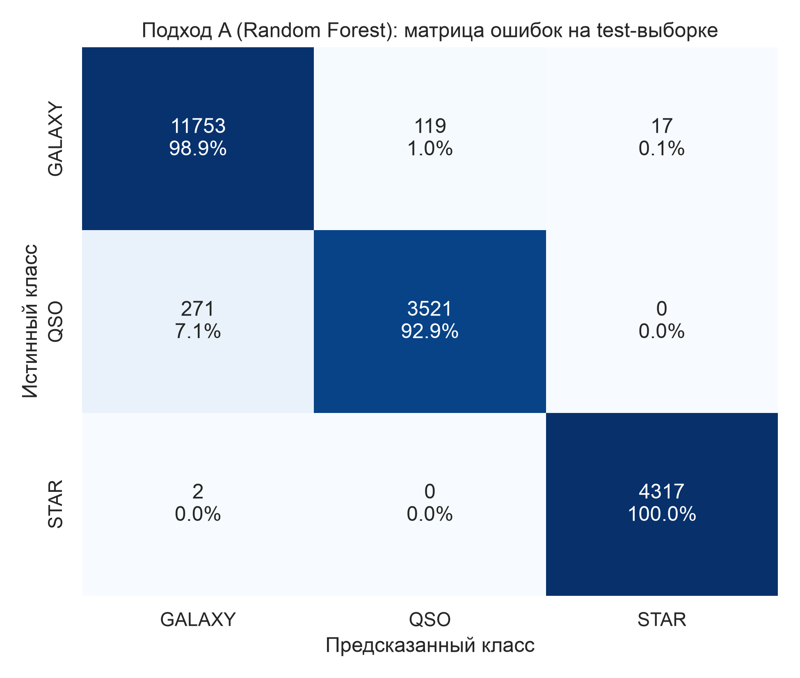

### 4.4. ROC-AUC (one-vs-rest)

| class | roc_auc_ovr | average_precision | positives |
|---|---|---|---|
| GALAXY | 0.994881 | 0.995391 | 11889 |
| QSO | 0.992855 | 0.98202 | 3792 |
| STAR | 0.99981 | 0.99881 | 4319 |

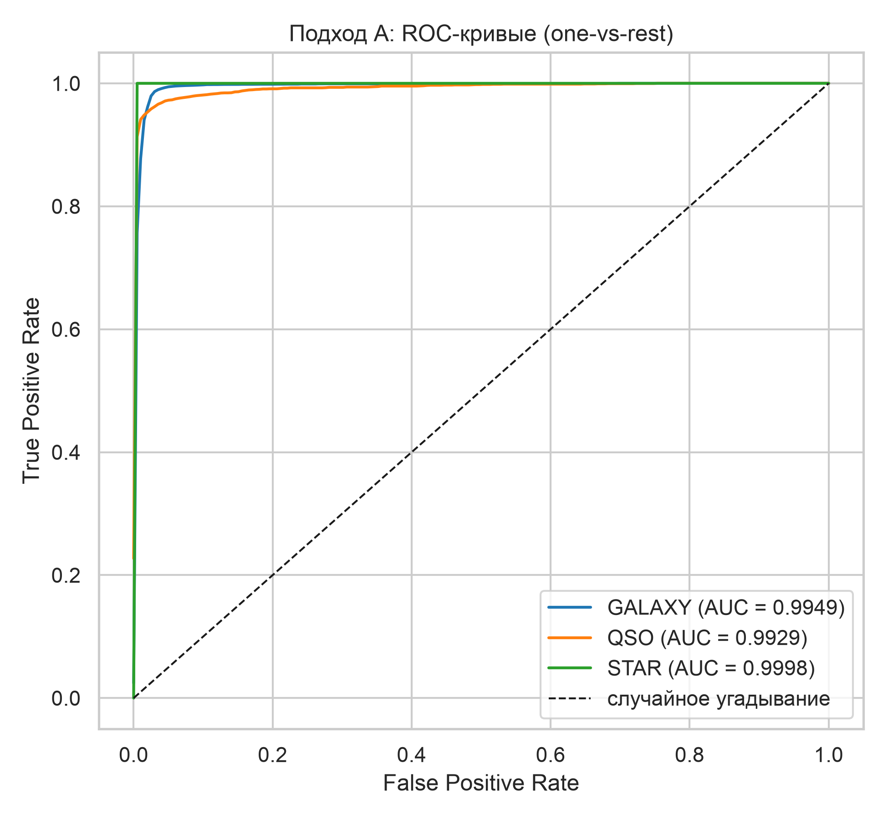

### 4.5. Важность признаков

| feature | importance |
|---|---|
| redshift | 0.6581521118873213 |
| z | 0.1040261834579151 |
| g | 0.0750927810658625 |
| i | 0.0666681535313744 |
| u | 0.0587105384232112 |
| r | 0.0373502316343153 |

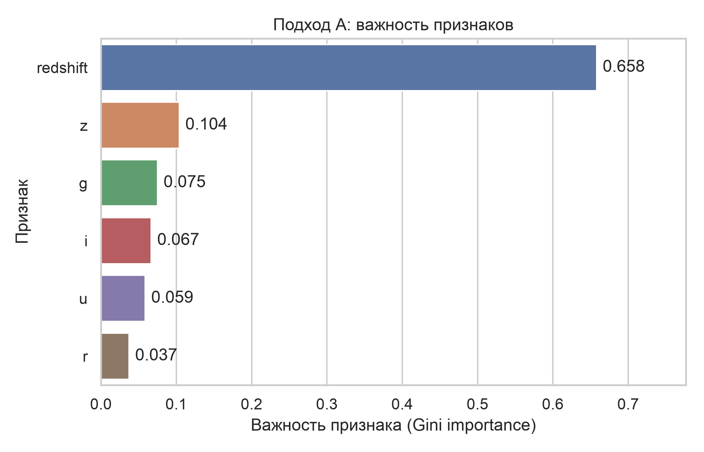

### 4.6. Кривая обучения

| n_train | fraction | cv_f1_macro_mean | cv_f1_macro_std | test_f1_macro |
|---|---|---|---|---|
| 4000 | 0.05 | 0.960556 | 0.001096 | 0.96791 |
| 8000 | 0.1 | 0.969917 | 0.003074 | 0.968836 |
| 19999 | 0.25 | 0.971688 | 0.001224 | 0.973241 |
| 39999 | 0.5 | 0.974298 | 0.000933 | 0.974671 |
| 60000 | 0.75 | 0.973591 | 0.001073 | 0.975895 |
| 79999 | 1.0 | 0.973936 | 0.000327 | 0.976371 |

Качество выходит на плато примерно на 20–40 тысячах объектов: дальнейшее увеличение
выборки прироста почти не даёт, то есть объёма данных для этой задачи с запасом хватает.

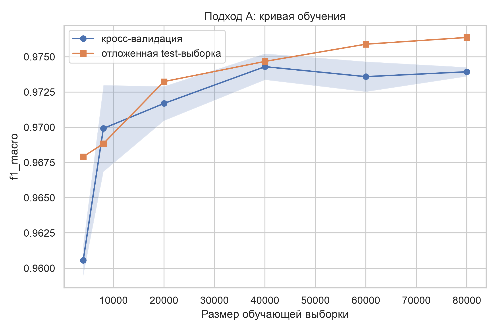

## 5. Подход B — кластеризация без учителя

Алгоритм: `KMeans`, k = 3, `n_init = 10`.
Обучение на полном масштабированном наборе признаков без столбца `class`
заняло 0.45 с.

### 5.1. Обоснование числа кластеров

| k | inertia | silhouette_score |
|---|---|---|
| 2 | 261956.987595 | 0.5032175629770607 |
| 3 | 193618.461583 | 0.44259679665663 |
| 4 | 152319.371271 | 0.3682444846977562 |
| 5 | 130592.794598 | 0.3397044639986002 |
| 6 | 113694.17195 | 0.3201869904542654 |
| 7 | 102001.939415 | 0.3250250168627489 |
| 8 | 93052.790829 | 0.3050106386892272 |

**Silhouette score не подтверждает k = 3.** Максимум приходится на k = 2
(0.5032 против 0.4426 при k = 3), а инерция убывает плавно, без выраженного
«локтя». Иначе говоря, без подсказки из меток геометрия данных трёх групп не выдаёт —
это отрицательный, но содержательный результат.

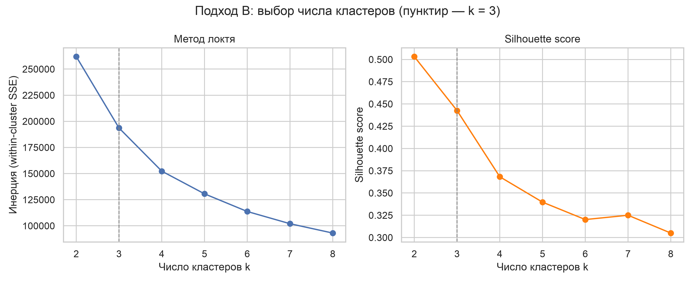

### 5.2. Сопоставление кластеров с классами

Majority vote: 0 → GALAXY, 1 → QSO, 2 → GALAXY.

| cluster_id | STAR_count | GALAXY_count | QSO_count | total | mapped_class | purity_of_cluster |
|---|---|---|---|---|---|---|
| 0 | 11248 | 19406 | 1311 | 31965 | GALAXY | 0.60710151728453 |
| 1 | 2 | 978 | 14928 | 15908 | QSO | 0.9383957757103344 |
| 2 | 10343 | 39061 | 2722 | 52126 | GALAXY | 0.7493573264781491 |

В долях:

| cluster_id | total | mapped_class | STAR_share | GALAXY_share | QSO_share |
|---|---|---|---|---|---|
| 0 | 31965 | GALAXY | 0.351885 | 0.607102 | 0.041014 |
| 1 | 15908 | QSO | 0.000126 | 0.061479 | 0.938396 |
| 2 | 52126 | GALAXY | 0.198423 | 0.749357 | 0.05222 |

**Ни один кластер не соответствует классу STAR.** K-Means режет пополам вытянутое
облако галактик, а звёзды растворяются внутри обоих галактических кластеров.
Квазары, наоборот, выделяются хорошо — за счёт большого красного смещения.

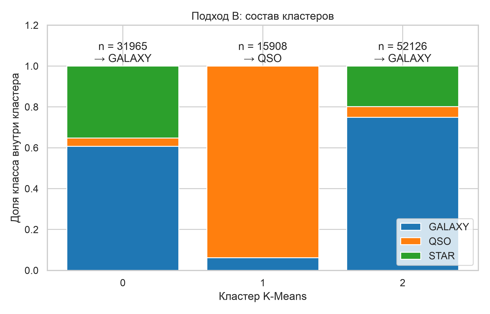

### 5.3. Визуализация в пространстве PCA

Две главные компоненты объясняют 90.58 % дисперсии
(74.92 % и 15.66 % соответственно).

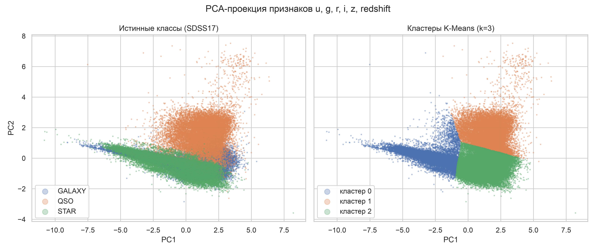

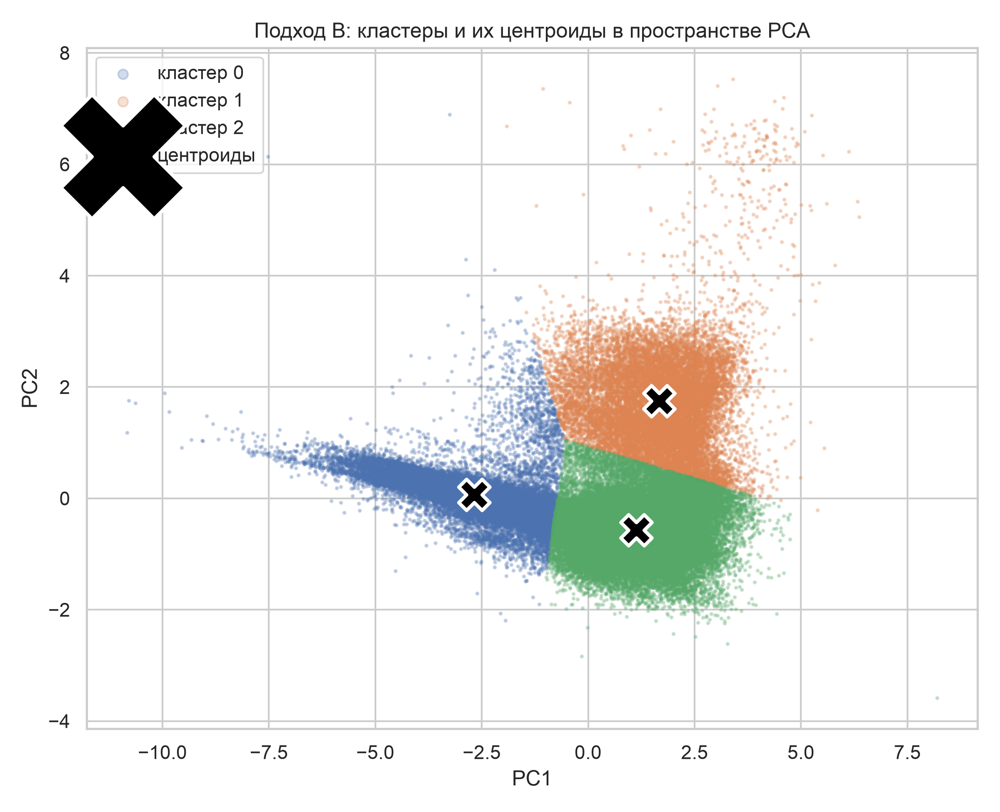

## 6. Сравнение подходов

| approach | metric | value |
|---|---|---|
| A | accuracy | 0.97955 |
| A | precision_macro | 0.980228 |
| A | recall_macro | 0.972211 |
| A | f1_macro | 0.976075 |
| A | train_time_sec | 9.209 |
| B | ari | 0.258043 |
| B | nmi | 0.309353 |
| B | purity | 0.733957 |
| B | silhouette | 0.442597 |
| B | train_time_sec | 0.454 |
| common | train_size | 79999.0 |
| common | test_size | 20000.0 |
| common | n_samples_total | 99999.0 |

| indicator | approach_a | approach_b | note |
|---|---|---|---|
| Доля верных отнесений | 0.97955 | 0.733957 | accuracy vs purity после majority vote |
| Согласие с истинной разметкой | 0.976075 | 0.258043 | f1_macro vs ARI |
| Время обучения, с | 9.209 | 0.454 |  |
| Использует метки при обучении | 1.0 | 0.0 | 1 — да, 0 — нет |

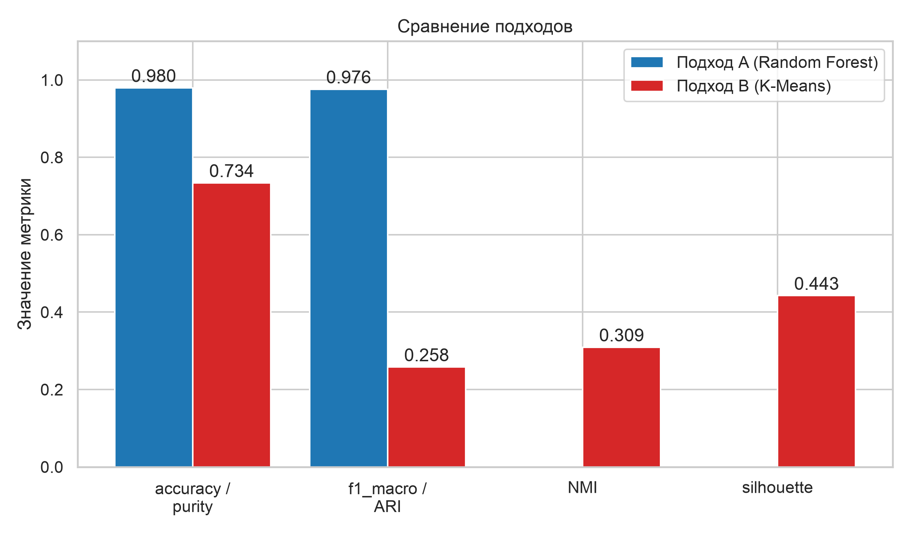

Прямое сравнение accuracy и ARI некорректно — метрики измеряют разное. Содержательно
сопоставимы две пары: accuracy против purity (доля объектов, попавших «куда надо»)
и f1_macro против ARI (согласие разметки с истиной с поправкой на случайность).
По обеим парам разрыв кратный.

Обучение без учителя при этом на два порядка быстрее, но эта экономия не окупает
потери качества: разметка в SDSS уже есть, и отказ от неё ничего не даёт.

## 7. Контрольные эксперименты

Все эксперименты выполнены в одинаковых условиях: те же гиперпараметры, то же
разбиение, отличается только состав признаков.

| experiment | description | n_features | rf_accuracy | rf_f1_macro | kmeans_ari | kmeans_purity | kmeans_silhouette |
|---|---|---|---|---|---|---|---|
| baseline | рабочий набор признаков (Подход A и B) | 6 | 0.97955 | 0.976075 | 0.258043 | 0.733957 | 0.442597 |
| with_coords | рабочий набор + координаты на небесной сфере | 8 | 0.97935 | 0.97589 | 0.261126 | 0.736217 | 0.303089 |
| coords_only | только координаты — контроль на утечку через геометрию обзора | 2 | 0.6865 | 0.549682 | -0.002311 | 0.594456 | 0.474088 |
| no_redshift | только фотометрия, без красного смещения | 5 | 0.8733 | 0.837344 | 0.020738 | 0.594456 | 0.378047 |
| redshift_only | только красное смещение | 1 | 0.94905 | 0.93755 | 0.252468 | 0.698597 | 0.639094 |
| colors_and_r | цветовые индексы + звёздная величина r, без redshift | 5 | 0.886 | 0.85296 | 0.227737 | 0.699377 | 0.340468 |
| colors_and_redshift | цветовые индексы + красное смещение | 5 | 0.97945 | 0.975996 | 0.313279 | 0.740237 | 0.340032 |

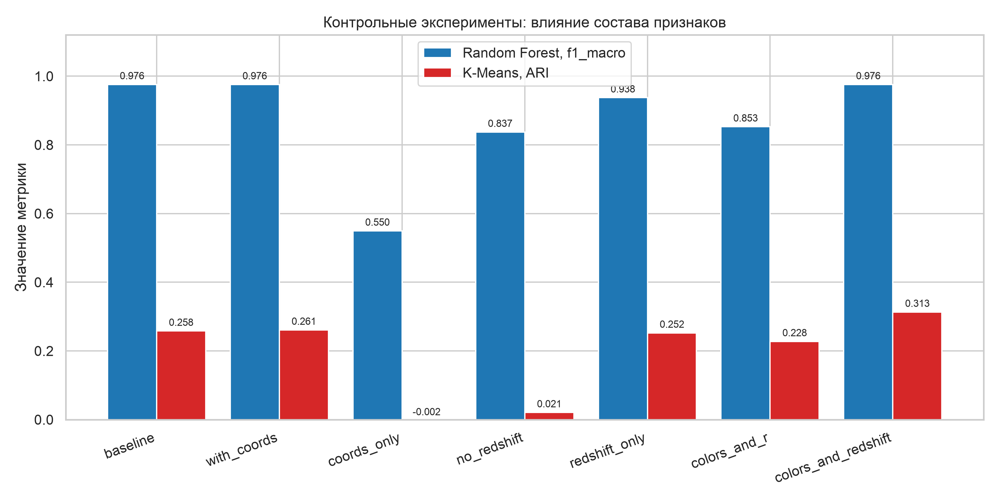

Выводы:

1. **Координаты действительно дают утечку.** Random Forest, обученный
   *только* на `alpha` и `delta`, показывает accuracy
   0.6865 — заметно выше доли
   самого частого класса (0.5945). Никакой физики за этим нет: модель запоминает,
   какие участки неба покрыты какими наблюдательными программами. Именно поэтому
   координаты исключены из рабочего набора.
2. **На полном наборе координаты ничего не добавляют**
   (f1_macro 0.9759 против
   0.9761) — `redshift` уже исчерпывает задачу.
3. **Красное смещение решает задачу почти в одиночку**: на одном этом признаке
   f1_macro = 0.9375. Без него, на чистой
   фотометрии, качество падает до
   0.8373.
4. **Для кластеризации важен переход к цветовым индексам.** Замена «сырых» звёздных
   величин на разности соседних фильтров поднимает ARI с
   0.2580 до
   0.3133 — заметный относительный
   прирост при том же алгоритме. Для Random Forest замена ничего не меняет: дерево
   и так способно построить разность признаков само.

## 8. Выводы

1. **Разрыв между подходами кратный.** Random Forest даёт f1_macro
   0.9761, K-Means — ARI 0.2580.
   По доле верно отнесённых объектов: 0.9796 против
   purity 0.7340.

2. **Классы физически перекрываются в пространстве признаков.** На PCA-проекции звёзды
   и галактики лежат на одном вытянутом гребне. K-Means со сферическими кластерами
   разделить их не может в принципе — он режет облако там, где плотность точек выше,
   а не там, где проходит физическая граница.

3. **Оптимальное k без меток не определяется.** Silhouette указывает на k = 2, а не 3;
   «локтя» на кривой инерции нет. Это существенно: даже зная, что классов три,
   исследователь без разметки не получил бы такого указания из самих данных.

4. **Задача почти целиком держится на красном смещении** — важность
   0.6582, а на одном этом признаке
   f1_macro достигает
   0.9375.
   Преимущество Random Forest в том, что он дополнительно использует нелинейные границы
   по цветам и добирает то, что redshift не разделяет.

5. **Состав признаков нужно контролировать явно.** Координаты на небесной сфере сами по
   себе дают accuracy
   0.6865
   — результат без физического смысла, порождённый геометрией обзора.

6. **Кластеризацию можно улучшить, не меняя алгоритм.** Переход к цветовым индексам
   поднимает ARI до
   0.3133.
   Разрыв с обучением с учителем это не закрывает, но показывает, что значительная часть
   слабости Подхода B — следствие представления признаков, а не только самого метода.

---

## 9. Приложение: реестр файлов

### Таблицы

| файл | описание | размер |
|---|---|---|
| `results/predictions_approach_a.csv` | построчные предсказания Подхода A на test-выборке | 1037 КБ |
| `results/predictions_approach_b.csv` | построчные результаты кластеризации на полном наборе | 3370 КБ |
| `results/metrics_summary.csv` | сводная таблица метрик обоих подходов | 0 КБ |
| `results/feature_importance.csv` | важность признаков Random Forest | 0 КБ |
| `results/confusion_matrix_a.csv` | матрица ошибок 3×3 в абсолютных числах | 0 КБ |
| `results/cluster_vs_class_table.csv` | перекрёстная таблица кластер × класс | 0 КБ |
| `results/cluster_vs_class_normalized.csv` | то же в долях | 0 КБ |
| `results/pca_projection.csv` | координаты PCA для обоих сравнительных графиков | 6545 КБ |
| `results/elbow_silhouette.csv` | инерция и silhouette для k = 2..8 | 0 КБ |
| `results/run_config.json` | параметры запуска и версии библиотек | 1 КБ |
| `results/dataset_report.json` | статистика очистки и баланс классов | 0 КБ |
| `results/training_meta.json` | тайминги и гиперпараметры этапов обучения | 1 КБ |
| `results/classification_report_a.csv` | precision/recall/f1 по каждому классу | 0 КБ |
| `results/feature_stats_by_class.csv` | описательная статистика признаков по классам | 2 КБ |
| `results/feature_correlation.csv` | матрица корреляций признаков | 0 КБ |
| `results/color_indices_by_class.csv` | статистика цветовых индексов по классам | 1 КБ |
| `results/color_indices.csv` | построчные цветовые индексы | 7950 КБ |
| `results/roc_auc_a.csv` | ROC-AUC и average precision (one-vs-rest) | 0 КБ |
| `results/roc_curves_a.csv` | точки ROC-кривых для перерисовки | 12 КБ |
| `results/approach_comparison.csv` | сопоставление подходов по общим показателям | 0 КБ |
| `results/control_experiments.csv` | контрольные эксперименты с наборами признаков | 1 КБ |
| `results/learning_curve.csv` | f1_macro в зависимости от объёма обучающей выборки | 0 КБ |
| `results/gridsearch_cv_results.csv` | полная таблица перебора гиперпараметров | 1 КБ |

### Иллюстрации

Все PNG — 300 dpi.

| файл | описание |
|---|---|
| `figures/confusion_matrix_a.png` | матрица ошибок Подхода A |
| `figures/pca_true_class_vs_cluster.png` | PCA: истинные классы против кластеров |
| `figures/elbow_plot.png` | выбор числа кластеров |
| `figures/feature_importance.png` | важность признаков |
| `figures/class_distribution.png` | баланс классов |
| `figures/feature_distributions.png` | распределения признаков по классам |
| `figures/color_color_diagram.png` | цвет-цветовая диаграмма |
| `figures/redshift_by_class.png` | красное смещение по классам |
| `figures/correlation_heatmap.png` | корреляции признаков |
| `figures/roc_curves_a.png` | ROC-кривые Подхода A |
| `figures/cluster_composition.png` | состав кластеров |
| `figures/pca_with_centroids.png` | кластеры и центроиды в PCA |
| `figures/approach_comparison.png` | сравнение подходов |
| `figures/control_experiments.png` | контрольные эксперименты |
| `figures/learning_curve.png` | кривая обучения |

### Модели

| файл | описание |
|---|---|
| `models/scaler.pkl` | `StandardScaler`, обучен на train-выборке |
| `models/random_forest_model.pkl` | обученная модель Подхода A |
| `models/kmeans_model.pkl` | обученная модель Подхода B |

Загружаются через `joblib.load`, переобучение не требуется.
